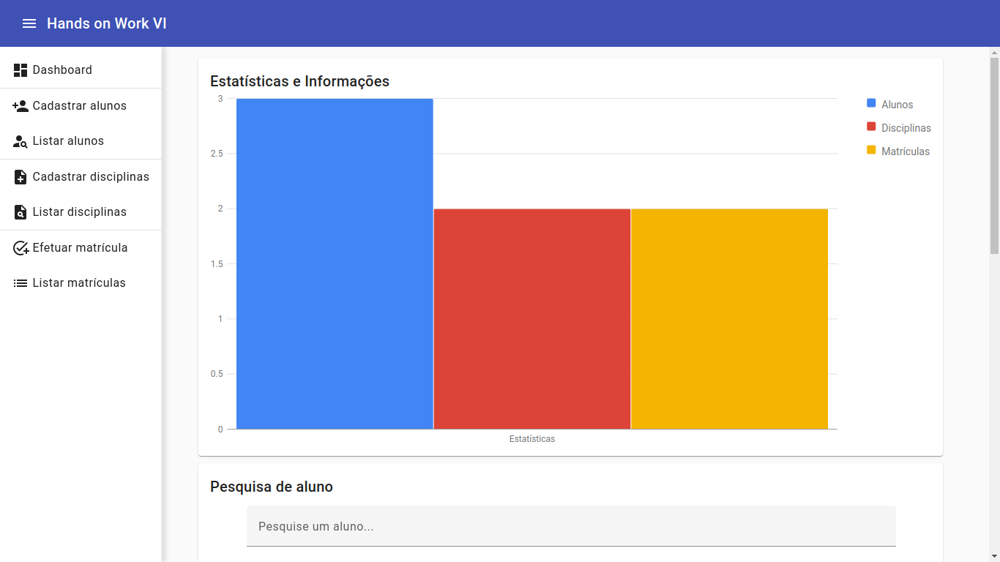

# Hands on Work VI



> Tela Inicial do Sistema.

### Descrição do Projeto

Sistema web para cadastro, edição e deleção de alunos e disciplinas e realização de matrícula

## 💻 Pré-requisitos

Antes de começar, verifique se você atende aos seguintes requisitos:

- Você possui a versão mais recente do `Angular 16.1.0` instalado.

### Configuração da API REST

```
# Iniciando o servidor
Certifique-se de que tenha o MySQL instalado em sua máquina.
Certifique-se que o MySQL esteja em executação na sua máquina.
Executar a API REST desenvolvida em Java e Spring.
Lembrando que por padrão a API vai funcionar no endereço: http://localhost:8080.
```

### Inicialização do Aplicativo

```
# Baixando o projeto
Após clonar o projeto execute o comando: npm install.
Caso encontre alguma vulnerabilidade execute o comando: npm audit fix.

# Executando o projeto
Inicializar o projeto com ng serve --o.
Lembrando que por padrão o projeto vai funcionar no endereço: http://localhost:4200.
```
